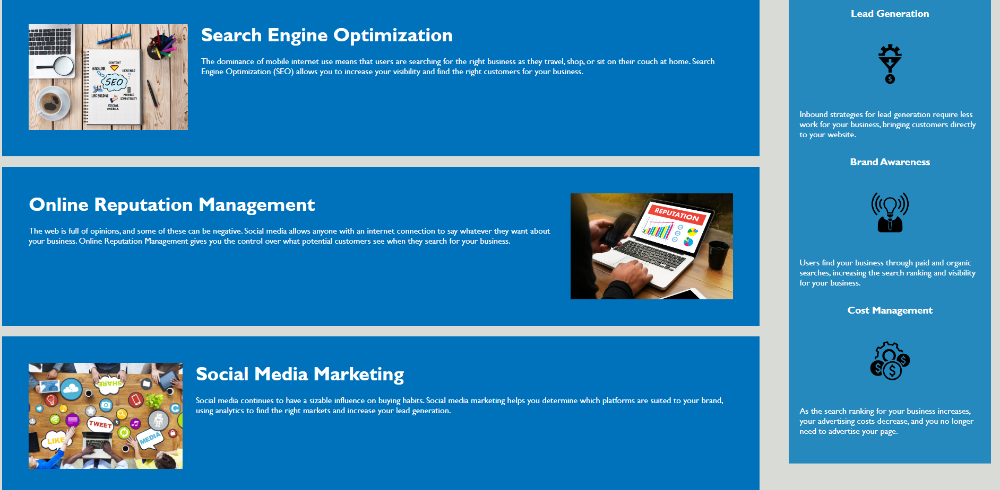

# Challengeone-accessibilityproj

## Description

This is my first challenge in the UT Austin Bootcamp. In completing this challenge, I refactored the original code and developed accessibility into the website. The goal of refactoring code is to restructure the code, making it cleaner than when I recieved it while not changing the functionality. Both the CSS and HTML files have been refactored, consolidated, and commented to assist with future development and accessibility for those using a screen reader. 

## Why is this important?

Providing accessibility in your websites allows those who are unable to access your website visually the ability to use a screen reader. Accessibility helps navigate the screen reader by providing clear and concise sections along with attributions to images that are explained to help provide a great user experience. With the help of HTML5, we can use the power of semantic syntax to provide overall professionalism within our pages.

## Accessibility

How does this webpage now have accessibility? Tags like `<header>, <footer>, <form>, <table>, <article> <nav>, and <section>` are called Semantic elements. Usings Semantic elements provides screen readers the ability to navigate a webpage appropriately and accurately. Non-semantic elements are `
 and `. Non-semantic elements provide zero information about the content contained within the tag leaving screen readers confused and the user experience even more confusing.

## Updated

What did we updated? Let me tell you! Part of my refactoring was going into the original code and switching out the non-semantic syntax `(changing the 
 to <section>, and <header>` and replacing it with semantic syntax. Once that was done I restructured the index file in sequential order and organized the code with comments that go along with the consolidation of the CSS file following the exact same sequential order. From there I consolidated the CSS, reducing the amount of code making it a cleaner and much more optimal experience for the next developer without altering the original functionality of the webpage.

## Screenshots

## License

MIT License

Copyright (c) 2022 fabien1313

Permission is hereby granted, free of charge, to any person obtaining a copy
of this software and associated documentation files (the "Software"), to deal
in the Software without restriction, including without limitation the rights
to use, copy, modify, merge, publish, distribute, sublicense, and/or sell
copies of the Software, and to permit persons to whom the Software is
furnished to do so, subject to the following conditions:

The above copyright notice and this permission notice shall be included in all
copies or substantial portions of the Software.

THE SOFTWARE IS PROVIDED "AS IS", WITHOUT WARRANTY OF ANY KIND, EXPRESS OR
IMPLIED, INCLUDING BUT NOT LIMITED TO THE WARRANTIES OF MERCHANTABILITY,
FITNESS FOR A PARTICULAR PURPOSE AND NONINFRINGEMENT. IN NO EVENT SHALL THE
AUTHORS OR COPYRIGHT HOLDERS BE LIABLE FOR ANY CLAIM, DAMAGES OR OTHER
LIABILITY, WHETHER IN AN ACTION OF CONTRACT, TORT OR OTHERWISE, ARISING FROM,
OUT OF OR IN CONNECTION WITH THE SOFTWARE OR THE USE OR OTHER DEALINGS IN THE
SOFTWARE.